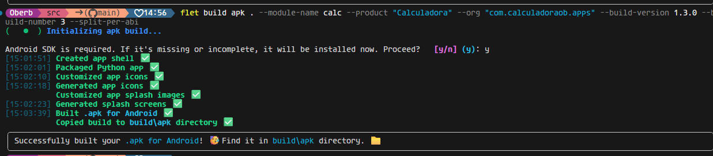

# Aprendiendo Flet

## Proyecto: Calculadora Cambiaria (Flet + Python)

Con este repositorio busco documentar mi proceso de aprendizaje con el framework **Flet**, con el objetivo final de desarrollar una herramienta de cálculo cambiario optimizada para el contexto venezolano.
Inspiración: [Al Cambio App](https://play.google.com/store/apps/details?id=com.alcambio.app&hl=es_VE)

## Idea principal
Desarrollar una aplicación móvil y web de conversión de divisas, pero enfocada en la **velocidad de usuario** sin publicidad que interrumpa el proceso, y pudiendo calcular varias tasas cambiarias a la vez. 

### 🚀 Objetivos 
- **Cálculo en Tiempo Real:** Implementación de funciones para conversiones instantáneas entre divisas.
- **Interfaz Limpia:** Diseño minimalista centrado en la utilidad para cálculos rápidos.

## 📖 Ruta

### Vs 1.0.0 (Publicada)

- Actualmente explorando la [documentación oficial de Flet](https://docs.flet.dev/)

Avances:
* Creación de Calculadora en Flet con Personalización
    Bugs resueltos:
    * Se elimina limitación de 4 decimales en los resultados
    * Evita operaciones con cero a la izquierda Ej. 12/03 pasa a 12/3
    * Doble punto 3..2 no permitido
* APK Generado
* Release v1.0.0 Publicado

### Vs 1.1 (Publicada)

* Cambio de Ico
* Refrescamiento de respuesta táctil
* Empaquetado independiente de APK por arquitectura 

#### Comportamiento Responsivo

### Vs 1.2 (Publicada)

* Se puede interactuar con el panel de la calculadora 
* Agregado de botón Delete (Retroceso) para borrar números

#### Vs 1.3 (Publicada)

* Al usar botón borrar en un símbolo, borra todos los símbolos dentro de la operación
* Agregar portapapeles al resultado
* Permitir calcular operaciones con números negativos (multiplicación y división)
* Maquetado de interfaz completo.
* Actualización dinámica de etiquetas (Text) para resultados. (Se observa con los resultados sin haber dado = )
* Diseño para que la app funcione en móviles. Totalmente responsiva en dispositivos y arquitecturas conocidas.

## Conclusiones:

En paralelo, se hacia exactamente lo mismo con Flutter.
Lo establecido como próximos pasos, se hará con FLutter, es muchísimo más fluido, rápido, y predecible.
Los tiempos de respuestas de la UI son infinitamente inmediatos en comparación con Flet.

Por lo cual:

- Manejo de entradas de usuario (TextFields) para montos.
- Conexión con API o Web Scrapping para obtener las tasas de cambio.

Será manejado, desarrollado e implementado a través de Dart.

Y con esto:

Se cierra el telón.

